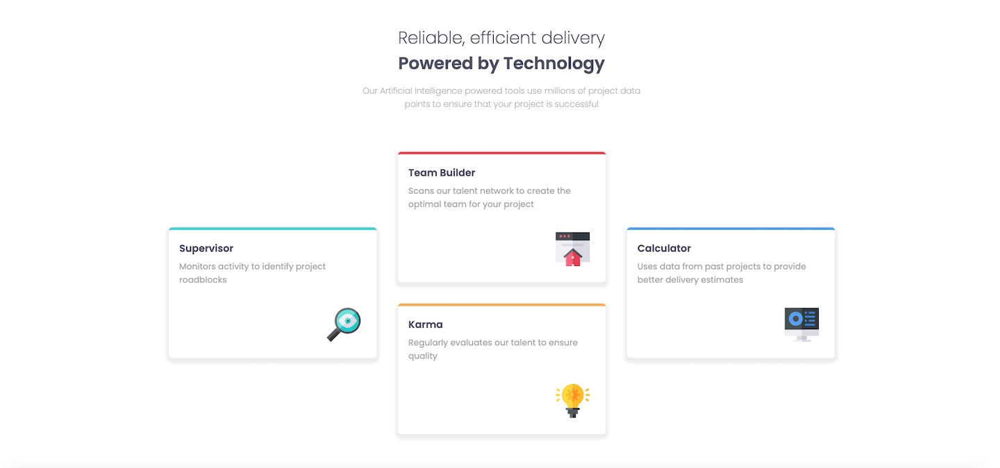

# Frontend Mentor - Four card feature section solution

This is a solution to the [Four card feature section challenge on Frontend Mentor](https://www.frontendmentor.io/challenges/four-card-feature-section-weK1eFYK). Frontend Mentor challenges help you improve your coding skills by building realistic projects.


### The challenge

Users should be able to:

- View the optimal layout for the site depending on their device's screen size

### Screenshot




### Links

- Solution URL: [Check out my solution](https://www.frontendmentor.io/solutions/four-card-feature-section-using-css-grid-and-flexbox-p-rGH20qL)
- Live Site URL: [Check out my live site](https://modu9173.github.io/Four-Card-Feature-Project/)

### Built with
- CSS custom properties
- CSS Grid


### What I learned

Finally understood how to use positioning (relative/absolute), CSS Grid and Flexbox.


```css
.features {
  display: grid;
  justify-content: center;
  grid-template-rows: repeat (4, 400px);
  grid-template-columns: repeat (3, 400px);
}

.team-builder {
  grid-row: 1 / 3;
  grid-column: 2 / 3;
}

media (max-width: 1278px) {
  .features {
    display: flex;
    flex-direction: column;
    align-items: center;
  }
```


### Continued development

After much difficulties of attempting to code CSS Grid in media queries, I opted for Flexbox which allowed the card to appear in column. 
Continue to practice using CSS Grid and Flexbox


## Author

- Website - [Modupe](https://github.com/Modu9173)
- Frontend Mentor - [@Modu9173](https://www.frontendmentor.io/profile/Modu9173)


## Acknowledgments
Thanks to another user of Frontend mentor that led me to learning CSS Grid, Flexbox and media queries. Thank you!

